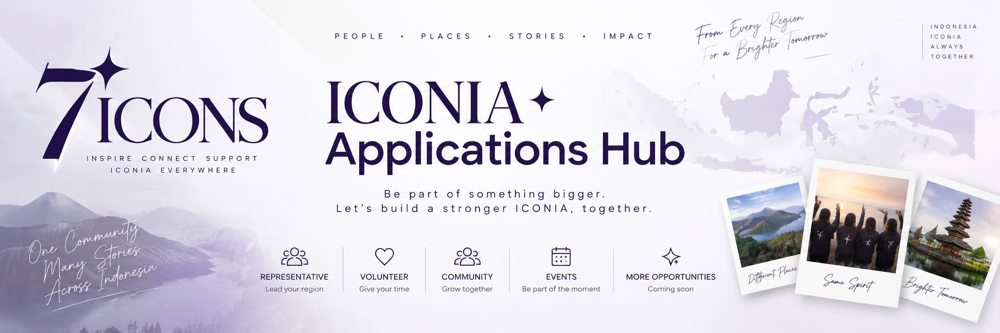

<div align="center">



<br />

# 7ICONS Apply

### ICONIA Applications Hub

**People • Places • Stories • Impact**

A dedicated public application platform for ICONIA community programs, regional opportunities, and future community initiatives across Indonesia.

</div>

---

## About

**7ICONS Apply** is the public application hub for the 7ICONS & ICONIA digital ecosystem.

The platform is designed to provide a structured, branded, and scalable way for people across Indonesia to apply for community programs and opportunities without relying on external form services.

Instead of creating a different website for every program, **7ICONS Apply** serves as one central application platform that can support multiple application types over time.

The platform will connect directly with the internal **7ICONS Admin Panel**, allowing applications to be reviewed, managed, approved, or rejected through a centralized workflow.

---

## Vision

> One Community, Many Stories, Across Indonesia.

7ICONS Apply is designed to help connect ICONIA communities from different regions while providing a clear and organized path for people who want to contribute.

From representatives and volunteers to regional communities and future programs, the platform is intended to grow alongside the ICONIA ecosystem.

---

## Application Programs

The platform is designed to support multiple public application programs.

### ICONIA Representative

Apply to represent ICONIA within a city or region in Indonesia.

Approved representatives may contribute regional content, community stories, articles, galleries, and interact with their local audience through the 7ICONS platform.

### Volunteer

Applications for people who want to support ICONIA activities, projects, or community initiatives.

### Community Registration

A structured way for regional ICONIA communities to introduce and register their community.

### Events

Applications or registrations related to selected ICONIA community events and activities.

### Future Opportunities

The application system is designed to support additional programs without requiring a separate website for every new initiative.

---

## Application Flow

```text
Applicant
    ↓
7ICONS Apply
    ↓
Choose Application Program
    ↓
Complete Application Form
    ↓
Submit Application
    ↓
Supabase
    ↓
7ICONS Admin
    ↓
Application Review
    ↓
┌──────────────┬──────────────┐
│   Approved   │   Rejected   │
└──────────────┴──────────────┘
```

Applications do **not** automatically grant access to internal systems.

Every application must be reviewed before further access or privileges are provided.

---

## ICONIA Representative Workflow

The ICONIA Representative program has an additional workflow after approval.

```text
Representative Application
          ↓
      Submitted
          ↓
     Under Review
          ↓
       Approved
          ↓
Create Representative Profile
          ↓
Invite Platform Account
          ↓
role = representative
          ↓
7ICONS Admin Limited Access
```

An approved ICONIA Representative account will have limited platform permissions based on their responsibilities.

### Planned Representative Access

```text
Dashboard
├── Personal / regional overview
│
Articles
├── Create
├── Edit own content
└── Submit for review
│
Gallery
├── Create albums
├── Upload photos
├── Edit own content
└── Submit for review
│
Comments
└── Reply to comments related to their content
```

Representatives will **not** receive access to sensitive administrative modules such as:

```text
Users Management
Staff Management
Members Management
Schedule Management
Global Settings
Role Management
Application Administration
```

---

## Roles & Access

The 7ICONS ecosystem separates internal staff roles from public community contributors.

### Internal Staff

Internal staff accounts are managed through the 7ICONS Admin Panel.

```text
super_admin
admin
editor
moderator
```

These accounts use an **invite-only workflow**.

They are not created through the public application website.

### ICONIA Representative

Approved regional representatives will use a dedicated role:

```text
representative
```

Displayed in the interface as:

```text
ICONIA Representative
```

This role is intended for regional contributors rather than internal staff.

Representative access will focus on:

- creating regional articles
- creating gallery albums
- uploading community photos
- editing their own content
- submitting content for review
- replying to comments related to their content
- viewing a limited regional dashboard

Representative accounts will not receive unrestricted administrative permissions.

---

## Planned Permission Model

| Feature | Super Admin | Admin | Editor | Moderator | ICONIA Representative |
| --- | --- | --- | --- | --- | --- |
| Dashboard | Full | Full | Limited | Limited | Personal |
| Articles | Full | Full | Full | View | Own Content |
| Gallery | Full | Full | Full | View | Own Content |
| Comments | Full | Full | Limited | Moderate | Reply Own Content |
| Members | Full | Full | Edit | No | No |
| Schedule | Full | Full | Edit | No | No |
| Fan Representatives | Full | Full | Edit | No | No |
| Users | Full | Limited | No | Moderate | No |
| Staff Management | Full | No | No | No | No |
| Applications | Full | Full | Review | No | No |
| Media | Full | Full | Limited | No | Own Uploads |
| Settings | Full | Limited | No | No | No |

The final permission structure may evolve as the platform develops.

---

## Content Ownership

Content created by ICONIA Representatives will be associated with their authenticated account.

For example:

```text
created_by = authenticated user UUID
```

This allows the platform to determine which content belongs to which representative.

A representative may therefore be allowed to:

```text
Create own article
Edit own article
Create own gallery
Edit own gallery
Reply to comments on own content
```

while administrators retain access to all content.

---

## Content Review Workflow

Representative-created content should not automatically become public.

The planned workflow is:

```text
ICONIA Representative
        ↓
Create Content
        ↓
Draft
        ↓
Submit for Review
        ↓
Editor / Admin
        ↓
Approve
        ↓
Published
```

This workflow can apply to both:

```text
Articles
Gallery Albums
```

Direct publishing permissions may be introduced later for trusted representatives if needed.

---

## Staff Management

7ICONS Apply is intended for **public and community applications only**.

Internal platform staff are not registered through this website.

Roles such as:

```text
Super Admin
Admin
Editor
Moderator
```

will use an **invite-only workflow** managed through the 7ICONS Admin Panel.

Example:

```text
Super Admin
    ↓
Admin Panel
    ↓
Team Management
    ↓
Invite Staff
    ↓
Select Role
    ↓
Invitation Sent
    ↓
Staff Account Activated
```

This keeps public applications and internal staff access completely separated.

---

## Application Management

Applications submitted through this platform will eventually be managed from:

**7ICONS Admin → Applications**

The planned management interface includes:

```text
All Applications

├── Representatives
├── Volunteers
├── Communities
├── Events
└── Future Programs
```

Applications may use statuses such as:

```text
Pending
Under Review
Approved
Rejected
Withdrawn
```

Administrators will be able to review applicant information and process applications without manually transferring data between systems.

---

## Representative Approval Flow

When an ICONIA Representative application is approved, the platform may eventually provide an automated workflow.

```text
Application Approved
        ↓
Create Fan Representative Profile
        ↓
Link Applicant Information
        ↓
Create / Invite Platform Account
        ↓
Assign Representative Role
        ↓
Link Account to Representative Profile
        ↓
Representative Gains Limited Admin Access
```

This avoids entering the same information multiple times.

---

## Representative Account Relationship

An approved representative profile may eventually be connected directly to a Supabase Auth account.

Example architecture:

```text
auth.users
    │
    ├── admin_roles
    │      └── role = representative
    │
    └── fan_representatives
           └── user_id
```

This allows the system to understand which representative is currently logged in.

For example:

```text
Account
Aulia Rahma

Region
DKI Jakarta

Role
ICONIA Representative
```

The platform can then provide a personalized dashboard.

---

## Representative Dashboard

The planned representative dashboard may include:

```text
Good Evening, Aulia

ICONIA Representative
DKI Jakarta

Your Articles
8

Your Galleries
12

Comments
34

Pending Review
2
```

The dashboard should focus only on information relevant to the representative's own regional activity.

---

## Planned Application Form

Application forms may use a multi-step experience instead of one long page.

Example for the ICONIA Representative program:

### Step 1 — Personal Information

```text
Full Name
Email
WhatsApp
Date of Birth
```

### Step 2 — Regional Information

```text
Province
City / Regency
Current Residence
```

### Step 3 — ICONIA Profile

```text
Instagram
How long have you been part of ICONIA?
Tell us about yourself
```

### Step 4 — Representative Application

```text
Why do you want to become an ICONIA Representative?

What can you contribute?

Tell us about the ICONIA community in your region.

Organization experience
Optional
```

### Step 5 — Supporting Information

```text
Profile Photo
Supporting Documents
Additional Information
```

### Step 6 — Review & Confirmation

```text
Review Application
Agreement
Submit Application
```

The exact fields may vary depending on the selected application program.

---

## Application Types

The platform is intended to use one centralized application system.

Applications may eventually be distinguished using an application type such as:

```text
representative
volunteer
community
event
project
```

This allows new programs to be added without creating a separate microsite.

---

## Platform Ecosystem

7ICONS Apply is part of the wider 7ICONS digital ecosystem.

```text
7ICONS Digital Ecosystem

├── 7icons-web
│   └── Public 7ICONS & ICONIA website
│
├── 7icons-admin
│   └── Content management
│       User management
│       Moderation
│       Applications
│       Staff management
│
└── 7icons-apply
    └── Public applications
        Community opportunities
        Regional programs
```

Each platform has a clearly separated responsibility.

---

## Planned Architecture

```text
                    ┌──────────────────┐
                    │   7icons-web     │
                    │  Public Website  │
                    └────────┬─────────┘
                             │
                             │
                             ▼
                    ┌──────────────────┐
                    │     Supabase     │
                    │                  │
                    │ PostgreSQL       │
                    │ Authentication   │
                    │ Storage          │
                    │ RLS              │
                    └───────┬──────────┘
                            │
              ┌─────────────┴─────────────┐
              │                           │
              ▼                           ▼
     ┌─────────────────┐        ┌─────────────────┐
     │  7icons-admin   │        │  7icons-apply   │
     │                 │        │                 │
     │ Admin Platform  │        │ Application Hub │
     └─────────────────┘        └─────────────────┘
```

All platforms are designed to share a common backend while maintaining clearly separated responsibilities.

---

## Planned Tech Stack

The project is planned to use the same modern web stack as the rest of the 7ICONS ecosystem.

### Frontend

- Next.js
- React
- TypeScript
- Tailwind CSS

### Backend

- Supabase PostgreSQL
- Supabase Authentication
- Supabase Storage
- Supabase Row Level Security

### Deployment

- Vercel

---

## Design Direction

7ICONS Apply will follow the visual identity shared by the wider 7ICONS platform.

### Visual Characteristics

- white backgrounds
- soft lavender surfaces
- violet and purple accents
- subtle gradients
- clean editorial typography
- rounded cards and form elements
- soft shadows
- responsive layouts
- welcoming community-oriented design

The goal is to create an application experience that feels like an integrated part of the 7ICONS ecosystem rather than a generic online form.

---

## User Experience

The application experience should be:

- simple
- clear
- mobile friendly
- easy to understand
- visually consistent
- accessible from different devices
- safe against accidental data loss

Planned features may include:

```text
Multi-step forms
Progress indicator
Form validation
Application review page
Submission confirmation
Responsive mobile interface
Application status tracking
```

---

## Application Status Tracking

Applicants may eventually receive an application reference number.

Example:

```text
Application ID

REP-2026-000128
```

Applicants could later check their application status.

```text
Application Status

Application:
REP-2026-000128

Program:
ICONIA Representative

Region:
DKI Jakarta

Status:
Under Review
```

This feature may be introduced after the initial application workflow is stable.

---

## Notifications

Future versions may support notifications for important application events.

Examples:

```text
Application Submitted
Application Under Review
Additional Information Requested
Application Approved
Application Rejected
Account Invitation Sent
```

Notifications may eventually be delivered through supported communication channels.

---

## Admin Applications Module

The Admin Panel will eventually include an Applications section.

Example:

```text
Applications

Total Applications
Pending Review
Approved
Rejected

──────────────────────────────────────

Applicant        Type              Status
Aulia Rahma      Representative    Pending
Nadia Putri      Volunteer         Approved
ICONIA Bandung   Community         Review
```

Administrators may then open a detailed application view.

---

## Application Detail

A representative application detail page may eventually include:

```text
Applicant Information

Name
Email
WhatsApp
Instagram

Regional Information

Province
City
Residence

ICONIA Information

Community Experience
Reason for Applying
Contribution Plan

Supporting Information

Profile Photo
Documents

Application Status

Pending
Under Review
Approved
Rejected
```

Administrative actions may include:

```text
Start Review
Request Information
Approve
Reject
```

---

## Security Principles

The platform will be designed around several core security rules.

### Public applicants cannot assign roles

Submitting an application never grants administrative access.

### Applications require review

Applications must be reviewed before approval.

### Staff access is invite-only

Internal staff accounts cannot be registered through the public application website.

### Representative access is restricted

Representative accounts receive only the permissions required for their responsibilities.

### Content ownership is enforced

Representatives can manage only content they are authorized to manage.

### Sensitive modules remain protected

Representatives cannot access:

```text
Users
Staff Management
Role Management
Settings
Application Administration
```

### Database access uses RLS

Supabase Row Level Security will be used to protect data access.

### Authentication identity is preserved

Content and platform actions will be linked to authenticated user IDs where appropriate.

---

## Privacy

Application forms may contain personal information.

The platform should therefore collect only information required for the relevant program.

Sensitive application information should only be accessible to authorized reviewers.

Public-facing representative profiles should contain only information specifically intended for public display.

Application information and public profile information should remain logically separated.

---

## Repository Structure

The project structure will evolve as development begins.

Planned structure:

```text
7icons-apply
│
├── public
│   └── brand
│
├── src
│   ├── app
│   ├── components
│   ├── lib
│   └── types
│
├── assets
│   └── 7icons-apply-banner.png
│
├── README.md
├── package.json
└── next.config.ts
```

---

## Development Principles

The project should remain:

- modular
- maintainable
- secure
- responsive
- scalable
- consistent with the existing 7ICONS ecosystem

Major features should be implemented incrementally and tested before moving to the next milestone.

---

## Project Status

**Current Status: Planning & Foundation**

| Area | Status |
| --- | --- |
| Repository Setup | ✅ |
| Visual Identity | ✅ |
| README / Project Definition | ✅ |
| Application UI | ⏳ |
| Application Database | ⏳ |
| Supabase Integration | ⏳ |
| Admin Integration | ⏳ |
| Representative Workflow | ⏳ |
| Application Status Tracking | ⏳ |
| Authentication | ⏳ |
| Production Deployment | ⏳ |

---

## Roadmap

### Phase 1 — Foundation

- initialize Next.js project
- configure TypeScript
- configure Tailwind CSS
- establish visual system
- configure Supabase
- define application database structure

### Phase 2 — Application Hub

- landing page
- program selection
- responsive layout
- application program cards
- reusable application components

### Phase 3 — Representative Applications

- ICONIA Representative landing page
- multi-step application form
- form validation
- application review
- submission flow
- confirmation page

### Phase 4 — Admin Integration

- Applications Management
- application list
- application filters
- application detail
- review workflow
- approve / reject actions
- application status updates

### Phase 5 — Representative Platform Integration

- create representative profile
- link application data
- invite representative account
- assign representative role
- restricted Admin Panel access
- content ownership rules

### Phase 6 — Representative Content Workflow

- create regional articles
- create gallery albums
- upload photos
- submit content for review
- editor approval
- comment replies

### Phase 7 — Additional Application Programs

- volunteer applications
- community registration
- event applications
- project contributor applications
- additional future programs

### Phase 8 — Applicant Experience

- application status tracking
- reference numbers
- application history
- additional information requests
- notifications

### Phase 9 — Production Hardening

- security review
- RLS review
- responsive testing
- validation testing
- error handling
- performance optimization
- deployment verification

---

## Future Possibilities

The architecture is intentionally designed to support future expansion.

Potential future capabilities include:

```text
Regional community directories
Representative activity reports
Application analytics
Program capacity limits
Application deadlines
Regional quotas
Applicant status portal
Email notifications
Community verification
Representative achievements
Regional contribution statistics
```

These features are not required for the initial release but can be added without replacing the core platform.

---

## Relationship With 7ICONS Web

The main public website remains:

```text
7icons-web
```

It is responsible for public content including:

```text
Articles
Members
Gallery
Schedule
Fan Representatives
About
Community Content
```

7ICONS Apply does not replace the main website.

Instead, it serves as the entry point for people who want to participate in community programs.

---

## Relationship With 7ICONS Admin

The Admin Panel remains:

```text
7icons-admin
```

It is responsible for internal operations including:

```text
Dashboard
Articles
Members
Gallery
Schedule
Fan Representatives
Users
Comments
Media
Applications
Staff Management
Roles & Permissions
Settings
```

Applications created through 7ICONS Apply are reviewed and processed through 7ICONS Admin.

---

## Relationship With Fan Representatives

The public website contains Fan Representative profiles.

The application platform handles people who want to become representatives.

The Admin Panel manages the approval process.

The relationship is:

```text
7icons-apply
     ↓
Representative Application
     ↓
7icons-admin
     ↓
Review & Approval
     ↓
fan_representatives
     ↓
7icons-web
```

Approved representatives may later receive limited access to `7icons-admin` for managing their own regional content.

---

## Non-Goals

7ICONS Apply is not intended to become:

- a public staff registration system
- an unrestricted admin registration portal
- a replacement for the main 7ICONS website
- a replacement for the Admin Panel
- a generic social network
- an automatic role assignment system

Its purpose is specifically to manage structured public applications and community opportunities.

---

## Philosophy

7ICONS Apply is not intended to be just another registration form.

It is designed as the entry point between the public ICONIA community and the wider 7ICONS digital platform.

Every application represents:

**a person**

**a place**

**a story**

**and a potential contribution to the community.**

---

<div align="center">

## ICONIA Applications Hub

### Different Places. Same Spirit. One Community.

**Built for ICONIA by ICONIA.**

</div>